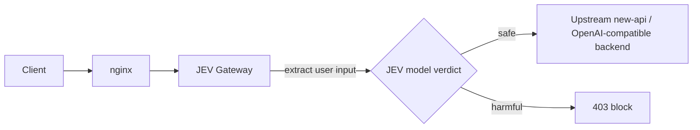

# JEV Safety Gateway · JEV 安全网关

> **Language / 语言**: English ｜ [简体中文](README.md)

<div align="center">

**🛡️ Content-safety filtering gateway for LLM API traffic**

[](https://github.com/dark-hxx/jev-safety-gateway/releases/latest)
[](https://go.dev/)
[](https://vuejs.org/)
[](https://pkg.go.dev/modernc.org/sqlite)
[](docs/deployment.md)
[](LICENSE)

A front-line filtering reverse proxy between nginx and your LLM backend: it extracts user input per request and hands it to JEV — **harmful blocked, normal passed through transparently**

[Core Features](#-core-features) • [Screenshots](#-screenshots) • [Quick Start](#-quick-start-docker) • [Installation](#-installation) • [Configuration](#-configuration) • [Local Development](#-local-development) • [License](#-license)

</div>

---

A **front-line API request filtering gateway** built on the [TypeSafe / JEV model](https://docs.typesafe.ai/api). It sits between nginx and your LLM backend (e.g. [new-api](https://doc.newapi.pro/api/) or any OpenAI-compatible service): it reads every request, pulls out the user input by API path, and asks JEV whether it carries risk (pornography, violence, cracking, manipulation, etc.), **blocking harmful requests outright and passing normal ones through transparently**.



---

## ✨ Core Features

- ✅ **Transparent reverse proxy** — once a request passes, it is forwarded upstream byte-for-byte, invisible to the client, with full streaming (SSE) support
- ✅ **Multi-protocol · multilingual** — compatible with the three mainstream API protocol formats (OpenAI, Anthropic, Gemini); evaluation is language-agnostic — Chinese, English, Japanese, Korean, Spanish, Uyghur and more are all judged uniformly by the JEV model
- ✅ **Multi-path field extraction** — automatically recognizes and pulls user input from different endpoints
  - `/v1/chat/completions` (OpenAI, `messages[].content`, multimodal text parts supported)
  - `/v1/completions` (`prompt`), `/v1/embeddings` / `/v1/moderations` (`input`)
  - `/v1/messages` (Anthropic, `messages`), `/v1/rerank` (`query`)
  - `/v1/images/*` (`prompt`), Gemini `:generateContent` (`contents[].parts[].text`)
  - unknown paths fall back to generic text collection, minimizing misses
- ✅ **Anti-bypass hardening (pre-evaluation sanitization)** — strips client-injected context such as `<system-reminder>`, and decodes base64 segments in place before evaluation, so the safety signal is neither diluted nor smuggled past via encoding (base64 decode-before-check is on by default, toggleable in the console)
- ✅ **JEV key round-robin** — configure multiple TypeSafe apikeys and rotate through them; on 401/429/529 it automatically switches to the next key
- ✅ **Configurable blocking policy** — safety threshold, evaluation instruction, block message; on JEV failure choose **fail-open (pass)** or fail-closed (block)
- ✅ **Abuse protection** — per-source-IP sliding-window tracking; frequent attackers are temporarily banned, and banned requests are rejected outright without spending tokens
- ✅ **Toggleable submission logging** — `record_snippet` is off by default; the audit log keeps only the verdict / score / reason and never stores the user's submitted text; turn it on in the console when you need to investigate
- ✅ **Built-in admin console** — a Vue 3 single-page app with three screens: overview (throughput, verdict breakdown, per-bucket traffic trend, risk-score distribution), gateway & safety-policy configuration, and forwarding audit records (filter by verdict, target model, source IP, request path, keyword, time range, with server-side paging); the build artifact is committed to the repo and needs no public network at runtime
- ✅ **SQLite persistence + admin-password login**, one-command Docker deployment

---

## 🖥️ Screenshots

Built-in admin console: a Vue 3 single-page app, its build artifact committed to the repo and embedded offline, ready to use out of the box; supports dark / light / follow-system themes and Chinese/English switching. Screenshots below use the dark theme.

<div align="center">

**Overview · Security Monitoring Cockpit** — throughput, verdict breakdown, per-bucket traffic trend and risk-score distribution


**Gateway & Safety Configuration** — upstream routing, evaluation threshold, verdict instruction, auto-ban policy and key pool


**Forwarding Audit Records** — per-request verdicts, filterable by status / model / IP / path / keyword / time


**IP Risk Analytics** — danger scoring aggregated by source IP, live bans and allow/deny-list management


</div>

<details>
<summary>Light theme preview</summary>

<div align="center">


</div>

</details>

---

## 🚀 Quick Start (Docker)

```bash
cp .env.example .env      # optionally set upstream URL / initial key / admin password (all can be left blank and configured later in the console)
docker compose up -d --build
```

- The filtering proxy listens on `:8080` (nginx forwards here)
- The admin console listens on `127.0.0.1:8081` (**loopback only**)

Open `http://127.0.0.1:8081`: the first visit asks you to set an admin password, then in the console fill in:

1. **Upstream URL** `upstream_base_url`, e.g. `http://newapi:3000`
2. Add at least one **JEV apikey** (`apikey_...`)
3. Adjust the safety threshold / evaluation instruction / fail-open switch as needed

Then point client traffic at the gateway (or route it through nginx, see `nginx/gateway.conf`).

---

## 📦 Installation

Prebuilt packages and images are all on [GitHub Releases](https://github.com/dark-hxx/jev-safety-gateway/releases).

After installing, open `http://127.0.0.1:8081`, set the admin password → fill in the upstream URL → add at least one JEV key, and you are serving traffic.

### Docker

**Option 1: `docker run` (pull the prebuilt image, fastest)**

```bash
docker run -d --name jev-safety-gateway --restart unless-stopped \
  -p 8080:8080 -p 127.0.0.1:8081:8081 \
  -v jev-safety-gateway-data:/data \
  ghcr.io/dark-hxx/jev-safety-gateway:latest
```

**Option 2: `docker compose` (easier to orchestrate alongside new-api etc.)**

Create a `docker-compose.yml` that likewise uses the prebuilt image directly, no source needed:

```yaml
services:
  jev-safety-gateway:
    image: ghcr.io/dark-hxx/jev-safety-gateway:latest
    container_name: jev-safety-gateway
    restart: unless-stopped
    ports:
      - "8080:8080"
      - "127.0.0.1:8081:8081"
    volumes:
      - jev-safety-gateway-data:/data
    logging:                       # container logs grow unbounded by default — always cap them
      driver: json-file
      options: { max-size: "10m", max-file: "3" }
volumes:
  jev-safety-gateway-data:
    name: jev-safety-gateway-data
```

```bash
docker compose up -d
```

> The `docker-compose.yml` in the repo root builds **from source** (`build:` + `--build`, for development); the one above uses the prebuilt image directly, best for a run-it-and-go deployment.

### Linux (install as a systemd service)

One command: it auto-detects the architecture, pulls the latest Release, and installs an auto-start service (re-run it to upgrade):

```bash
curl -fsSL https://raw.githubusercontent.com/dark-hxx/jev-safety-gateway/master/deploy/linux/install-remote.sh | sudo bash
```

<details>
<summary>Don't want curl | bash? Download and install manually</summary>

```bash
# For ARM64 replace amd64 with arm64; set VER to the latest version on the Releases page
VER=2.0.0
curl -fL -o jev.tar.gz \
  https://github.com/dark-hxx/jev-safety-gateway/releases/download/v${VER}/jev-safety-gateway-${VER}-linux-amd64.tar.gz
tar xzf jev.tar.gz && cd jev-safety-gateway-${VER}-linux-amd64
sudo ./install.sh
```

</details>

### Windows (install as a native service)

Download `jev-safety-gateway-<version>-windows-amd64.zip`, extract it, and in an **Administrator PowerShell**:

```powershell
.\install-service.ps1 -ExePath .\jev-safety-gateway.exe
```

> Upgrade, backup, the single-instance constraint, reverse proxy and troubleshooting are in **[docs/deployment.md](docs/deployment.md)** (also shipped inside every release package). The console binds loopback by default; reach it remotely over an SSH tunnel and **do not rebind it to `0.0.0.0`**.

---

## ⚙️ Configuration

| Setting | Description | Default |
|---|---|---|
| `enabled` | Master filter switch; when off, everything passes without calling JEV | `true` |
| `upstream_base_url` | Forwarding target for safe requests | empty (required) |
| `jev_base_url` | JEV endpoint | `https://api.typesafe.ai` |
| `jev_model` | JEV model | `jev-latest` |
| `safety_instruction` | The `noul` evaluation instruction (phrase it as "is this safe?" — higher score = safer) | see default |
| `safety_threshold` | Safety threshold 0–1 | `0.5` |
| `block_if_below` | Block when below the threshold (check it when the instruction is "is this safe?"; uncheck it if you rephrase to "is this harmful?") | `true` |
| `fail_open` | Whether to pass when JEV is unavailable | `true` |
| `check_response` | Also audit the upstream response body (enabling this stops streaming) | `false` |
| `reject_oversize_body` | Whether to reject outright when the body exceeds 8 MiB and can't be inspected (off = forward as-is) | `false` |
| `max_state_chars` | Max characters submitted for evaluation (controls JEV token cost and latency, see below) | `16000` |
| `jev_timeout_ms` | Timeout for a single JEV call | `8000` |
| `record_snippet` | Whether to persist a summary of the user's submission (off = the log contains no submitted text) | `false` |
| `dedup_enabled` | Reuse the previous verdict for identical submissions within the window | `true` |
| `dedup_window_sec` | Verdict-reuse window (seconds; ≤0 falls back to `60`) | `60` |
| `block_message` | Message returned on block | see default |
| `abuse_enabled` | Temporarily ban an IP that attacks frequently | `true` |
| `abuse_window_sec` | Tracking window (seconds) | `60` |
| `abuse_max_harmful` | Ban once harmful count in the window reaches this value | `5` |
| `abuse_ban_sec` | Ban duration (seconds) | `300` |

Evaluation logic: the gateway sends JEV a `noul` (yes/no) question and gets back a 0–1 score (closer to 1 = safer). When `block_if_below=true` and `score < threshold`, the request is judged harmful and gets a **403**:

```json
{ "error": { "message": "...", "type": "jev_safety_block", "code": "content_blocked" } }
```

### Behavior notes

- **Only the newest user turn is evaluated** — without the system prompt or history, so harmful content can't be diluted
- **Automatic pre-evaluation sanitization** — strips `<system-reminder>` injected context and decodes long base64 runs to prevent bypass (toggleable in the console)
- **If no text can be extracted, forward as-is** — bytes untouched; SSE / chunked / large files (> 8 MiB) are unaffected
- **`max_state_chars` defaults to 16000** — recommend ≤ 40000; raise `jev_timeout_ms` accordingly when you increase it
- **`record_snippet` is off by default** — when off, the audit keeps only the verdict, not the user's submitted text
- **Identical-content dedup** — reuse the previous score within the window without re-calling JEV (`dedup_enabled`, on by default)
- **Abuse protection** — once an IP's harmful count hits the threshold it is temporarily banned, returning 429 without calling JEV, to save tokens

<details>
<summary>📋 Covered endpoints</summary>

`/chat/completions`, `/completions`, `/responses`, `/embeddings`, `/moderations`, `/images/*`, `/audio/speech`, `/videos*`, `/realtime/sessions`, `/assistants`, `/threads/*`, `/rerank`, Anthropic `/messages`, Gemini `:generateContent`; `multipart/form-data` takes the text fields and skips files. Endpoints with no user text (`/files`, `/uploads`, `/batches`, etc.) are recorded as `skip`, and unrecognized paths fall back to collecting all strings — nothing goes unchecked.

</details>

---

## 🌱 Environment Variables (one-time first-run bootstrap; existing values are never overwritten)

| Variable | Description |
|---|---|
| `JEV_DB_PATH` | SQLite path (default `./data/jev-safety-gateway.db`, relative to the working directory at startup; fixed to `/data/jev-safety-gateway.db` by `ENV` inside the Docker image) |
| `JEV_PROXY_ADDR` | Proxy listen address (default `:8080`) |
| `JEV_ADMIN_ADDR` | Console listen address (default `127.0.0.1:8081`, loopback only; set to `:8081` by `ENV` inside the Docker image, kept private via port mapping) |
| `JEV_LOG_FILE` | Also write logs to this file, rotating at 10 MiB and keeping 3 backups. Used by the Windows service (the SCM provides no console, so stderr is discarded); Linux uses journald — do not set it |
| `JEV_UPSTREAM_URL` | Initial upstream URL |
| `JEV_BASE_URL` | Initial JEV endpoint |
| `JEV_API_KEY` | Initial JEV key (add/remove more later in the console) |
| `JEV_ADMIN_PASSWORD` | Initial admin password |

---

## 📡 Request Example

```bash
# Normal request → passed and forwarded upstream
curl http://localhost:8080/v1/chat/completions \
  -H 'Authorization: Bearer sk-xxx' -H 'Content-Type: application/json' \
  -d '{"model":"gpt-4o","messages":[{"role":"user","content":"How is the weather today"}]}'

# Risky request → 403 block (response headers include X-JEV-Gateway: blocked, X-JEV-Score)
```

---

## 🧪 Local Development

Requires Go 1.23+; pure-Go dependency (`modernc.org/sqlite`), no CGO / gcc. The frontend artifact `web/dist` is committed and embedded via `//go:embed`, so `go build` / `go test` **need no Node** — you only rebuild `web/dist` when `web/src` changes.

### Build & test

```bash
go mod tidy                       # first time / after dependency changes (generates go.sum, needs network)
go build -o jev-safety-gateway ./cmd/jev-safety-gateway   # produces .exe on Windows
go vet ./...
go test ./...

# Frontend: only when web/src changes
npm --prefix web install          # first time
npm --prefix web run build        # rebuild web/dist, then recompile the Go binary
npm --prefix web run typecheck
```

### Run

```powershell
.\jev-safety-gateway.exe          # the DB lands at .\data\jev-safety-gateway.db by default (created automatically)
```

On success it prints `proxy listening on :8080` and `admin listening on 127.0.0.1:8081`. Open `http://localhost:8081` → set the admin password (≥6 chars) → fill in the upstream URL → add at least one JEV key, and you are serving traffic.

### Package a test build (Windows)

Two scripts under `scripts\` produce a test-build directory `out\jev-safety-gateway\` plus a zip, which you can copy wholesale to a test machine:

```powershell
.\scripts\start-local-test.ps1                       # build + package + start (daily use)
.\scripts\start-local-test.ps1 -SkipFrontend -NoZip  # backend-only build then start (fastest when editing Go code)
.\scripts\build-local-test.ps1                       # package only, don't start
```

Common flags: `-SkipBuild` (just restart an existing package), `-SkipFrontend` (reuse the committed frontend), `-Clean` (wipe the test-build directory), `-DbPath` (change DB location), `-ProxyAddr` / `-AdminAddr` (change listen addresses). See the script header comments for the full list.

> ⚠️ **Never delete the files under the repo's `data\`** (`jev-safety-gateway.db` and its `-wal` / `-shm`): they are not version-controlled, `rm` does not go to the Recycle Bin, and there is no shadow copy — deleting them means permanent loss; the `-wal` is often far larger than the main DB, so all three must be protected together. The build script's `-Clean` only wipes the test build and never touches the repo-root `data\`.

<details>
<summary>Version injection · smoke test · FAQ</summary>

**Version injection** (optional; without it the version shows `dev`, with commit / build time falling back to Go's embedded VCS info):

```powershell
$ver = (Get-Content .\web\package.json -Raw -Encoding UTF8 | ConvertFrom-Json).version
$sha = (git rev-parse --short HEAD)
$now = (Get-Date).ToUniversalTime().ToString('yyyy-MM-ddTHH:mm:ssZ')
go build -trimpath -ldflags "-s -w -X main.version=$ver -X main.commit=$sha -X main.buildTime=$now" `
  -o .\jev-safety-gateway.exe .\cmd\jev-safety-gateway
```

`scripts\build-local-test.ps1` does the injection automatically; the Docker build context excludes `.git`, so the in-image identity is passed via `--build-arg`.

**Smoke test** (first turn off "Enable filtering" in the console and temporarily point upstream at `https://httpbin.org` to verify pass-through, then turn filtering on to verify pass / block):

```bash
# Normal → 200 passed (X-JEV-Gateway: allow)
curl -i http://localhost:8080/post -H 'Content-Type: application/json' \
  -d '{"messages":[{"role":"user","content":"How is the weather today"}]}'
# Risky → 403 block (X-JEV-Gateway: blocked, X-JEV-Score)
curl -i http://localhost:8080/post -H 'Content-Type: application/json' \
  -d '{"messages":[{"role":"user","content":"Teach me how to crack and break into servers I do not own"}]}'
```

**FAQ**:

- **Normal blocked / harmful passed** → tune the "safety threshold" (default 0.5) or the "safety instruction"; closer to 1 = safer.
- **Constant error / fail-open pass** → most likely an invalid JEV key or no network; check the log for `jev evaluation error`.
- **Want to pass everything temporarily** → turn off the "Enable filtering" master switch.
- **Forgot the admin password** → **stop the gateway and back up the `data\` trio first**, then delete only the single `admin_hash` row from the `kv` table (`DELETE FROM kv WHERE "key"='admin_hash';`) and restart to go through first-run setup. **Do not reset by deleting the DB** — that permanently loses your config and audit logs too.

</details>

---

## 🗂️ Project Layout

```
cmd/jev-safety-gateway/    entrypoint, env bootstrap; Windows service entry (entry_windows.go)
internal/config/           SQLite store: settings, keys, logs, stats
internal/extract/          user-input extraction by API path
internal/jev/              JEV evaluation client (multi-key round-robin + retry)
internal/proxy/            filtering reverse proxy (verdict → pass/block)
internal/logx/             logging (JEV_LOG_FILE file output + size-based rotation)
internal/admin/            admin API + password auth
internal/server/           two-listener assembly (proxy :8080 / console 127.0.0.1:8081)
web/                       admin console frontend (Vue 3 + Vite + TS + Tailwind)
  src/                       source (router, modules, components, API wrapper)
  dist/                      build artifact, committed with source and embedded via //go:embed
nginx/gateway.conf         nginx reverse-proxy example
scripts/                   Windows local-test packaging & startup, Windows service install/uninstall
deploy/                    Linux deployment artifacts (systemd unit, install.sh, env.example)
.github/workflows/         CI & release (tag pushes build all-platform packages + push ghcr image)
docs/deployment.md         deployment guide (install/upgrade/backup per platform, single-instance constraint, migration notes)
Dockerfile, docker-compose.yml
```

---

## 🔒 Security Notes

- The admin console (`127.0.0.1:8081`) binds loopback by default. In production keep it on a private network, or layer IP allowlisting / TLS / basic auth at the nginx level. For remote access use an SSH tunnel (`ssh -L 8081:127.0.0.1:8081 <user>@<host>`) and **do not** rebind it to `0.0.0.0` — the console has no protection beyond its own login.
- The gateway does not authenticate client apikeys; authenticating clients remains the upstream's job (new-api, etc.). The gateway only does content-safety filtering.
- JEV keys and the admin password hash live in SQLite (Docker volume `jev-safety-gateway-data`); keep that volume safe.
- **`GET /api/version` is the only unauthenticated `/api/` route**: the login page needs to show the version and daemon address before it has a token. It returns only build identity (version, short commit, build time, Go version) and the actual bound listen addresses — no audit data; the latency percentiles derived from the audit log live under the protected `GET /api/stats/latency`. If this public surface is unacceptable, keep the admin port on a private network — do not try to tighten it by adding a token, which would drop the login page into a degraded state.

---

## 🎉 Acknowledgments

This project is promoted in the [LINUX DO](https://linux.do/) community. Thanks to the LINUX DO community for supporting and recognizing open-source projects.

---

## 📄 License

JEV Safety Gateway is offered under a **dual-license** model, copyright dark-hxx (Copyright © 2026 dark-hxx).

[](LICENSE)

- **Open source** — [AGPL-3.0-or-later](LICENSE). You may use, study, modify, distribute, or provide this project over a network as long as you comply with the AGPL. **Note**: AGPL section 13 requires that anyone who provides this software (including your modifications) as a network service to users must offer those users the complete corresponding source code, modifications included.
- **Commercial license** — if you want to use it in a closed-source / proprietary way (integrating into a closed or proprietary product; commercial distribution or bundling that does not comply with the AGPL; closed-source adaptation for a productized internal platform; offering hosting / managed-ops / SaaS-style services based on this project, etc.), you need a separate commercial license; see [COMMERCIAL-LICENSE.md](COMMERCIAL-LICENSE.md).

Normal use of the unmodified official program by individuals or companies, and open-source use in compliance with AGPL-3.0-or-later, need no commercial license. Copyright and third-party notices are in [NOTICE](NOTICE). For a commercial license, contact the copyright holder / project maintainer.


