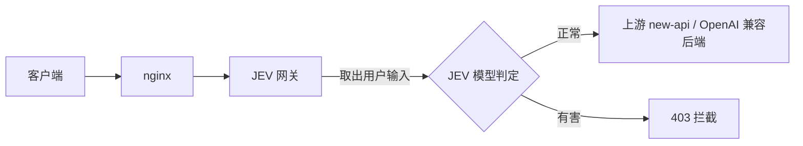
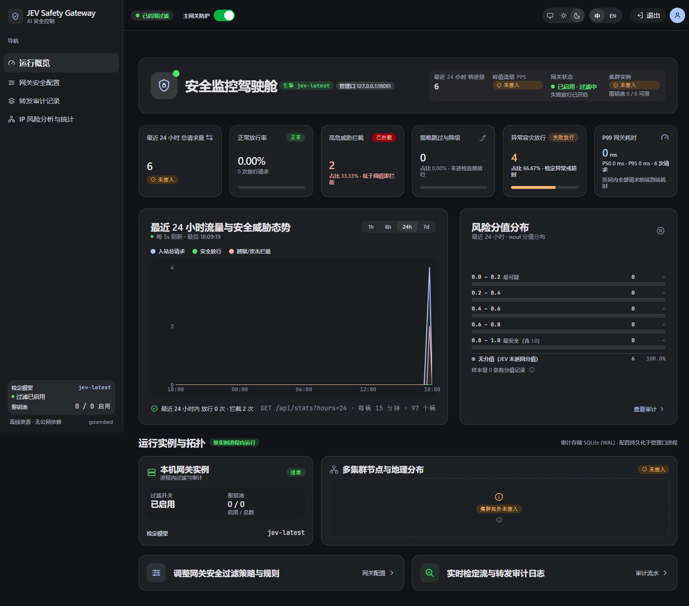
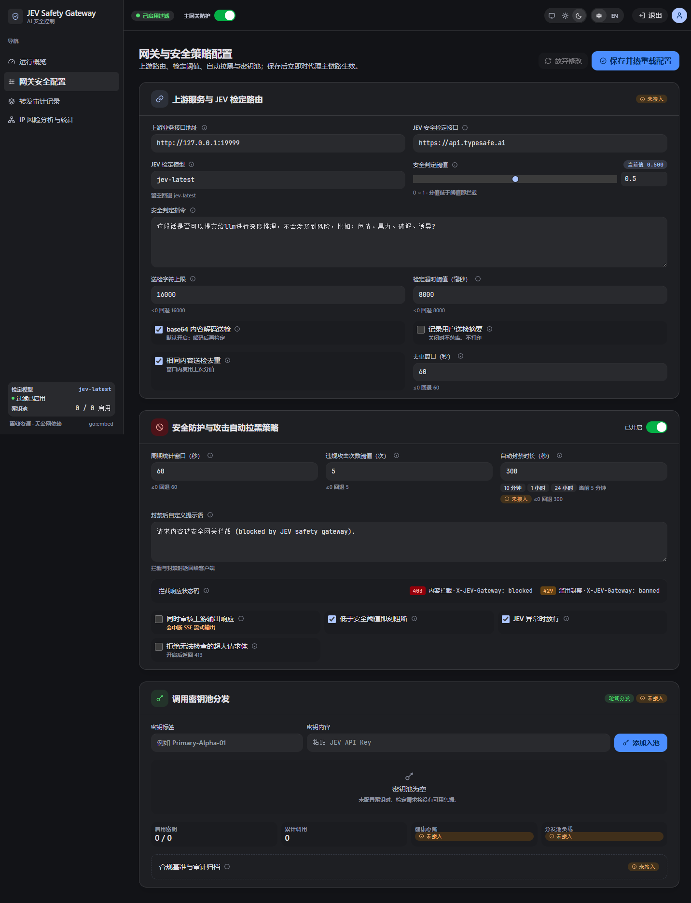
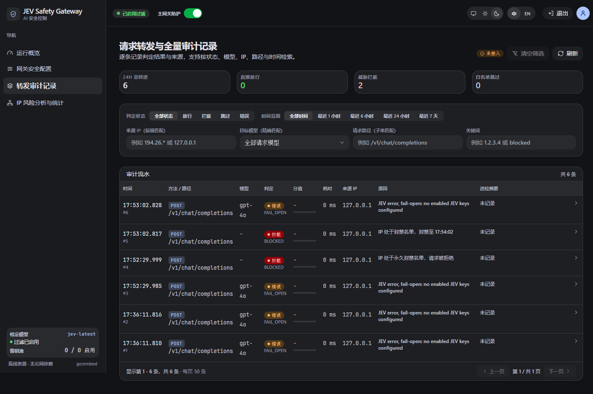
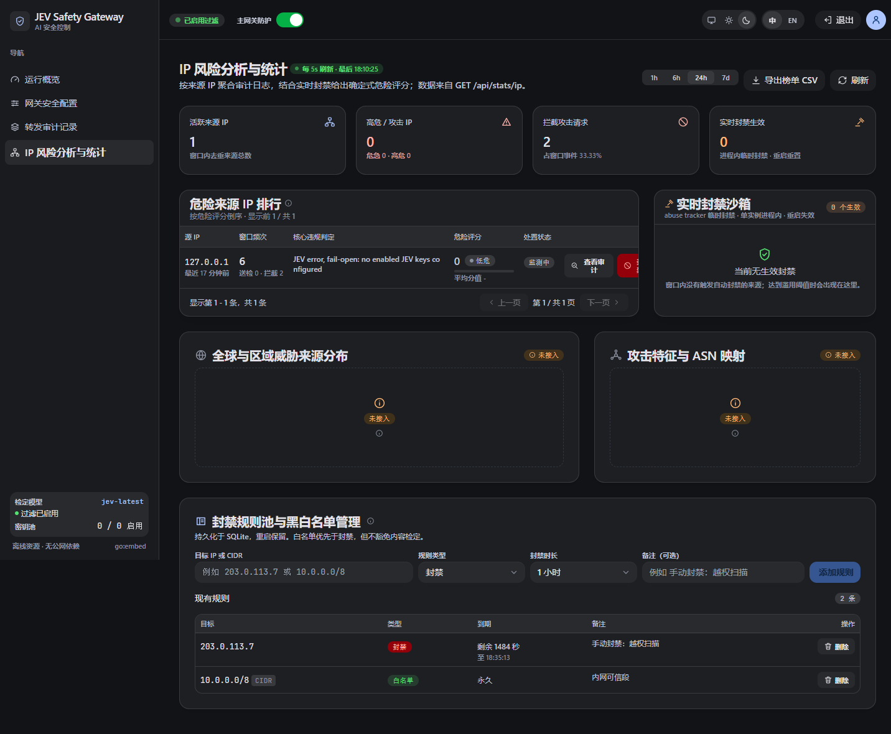
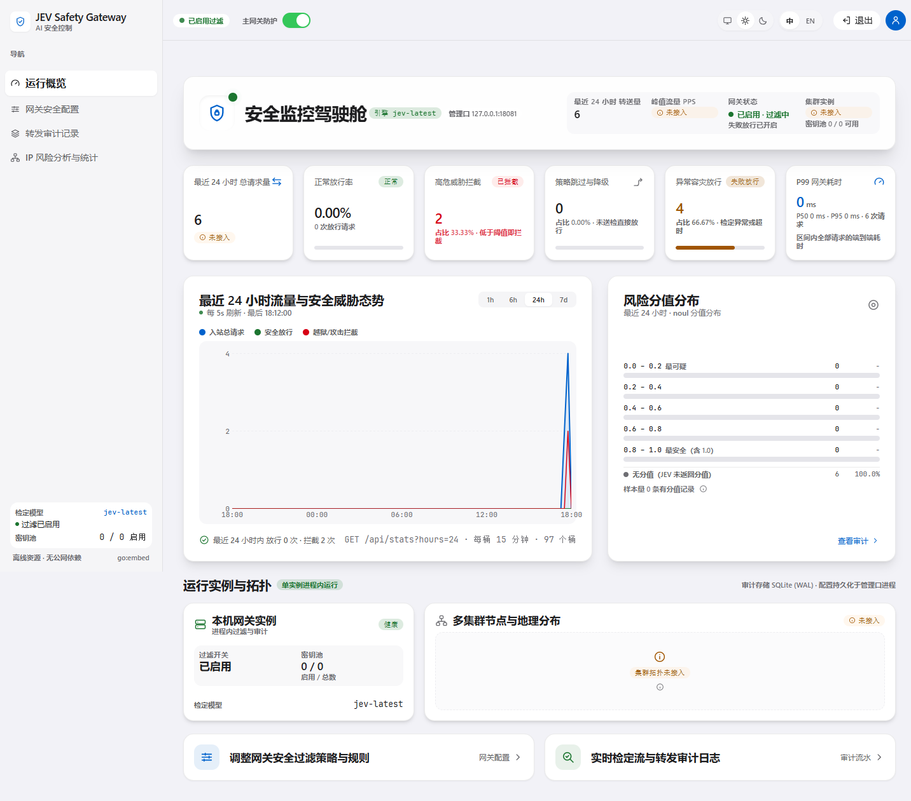

# JEV 安全网关 · JEV Safety Gateway

> **语言 / Language**：简体中文 ｜ [English](README.en-US.md)

<div align="center">

**🛡️ 面向大模型 API 流量的内容安全过滤网关**

[](https://github.com/dark-hxx/jev-safety-gateway/releases/latest)
[](https://go.dev/)
[](https://vuejs.org/)
[](https://pkg.go.dev/modernc.org/sqlite)
[](docs/deployment.md)
[](LICENSE)

位于 nginx 与大模型后端之间的前置过滤反向代理：逐请求提取用户输入交给 JEV 判定，**有害拦截、正常透明放行**

[核心特性](#-核心特性) • [界面展示](#-界面展示) • [快速开始](#-快速开始docker) • [快速安装](#-快速安装) • [配置项说明](#-配置项说明) • [本地开发](#-本地开发) • [开源协议](#-开源协议)

</div>

---

基于 [TypeSafe / JEV 模型](https://docs.typesafe.ai/api) 的**前置 API 请求过滤网关**。它位于 nginx 与你的大模型后端（如 [new-api](https://doc.newapi.pro/api/) 或任何 OpenAI 兼容服务）之间：读取每个请求，按 API 路径取出用户输入，交给 JEV 判定是否有风险（色情、暴力、破解、诱导等），**有害请求直接拦截、正常请求透明放行**。



---

## ✨ 核心特性

- ✅ **透明反向代理** — 判定通过后原样转发到上游，客户端无感知，完整支持流式（SSE）响应
- ✅ **多协议格式 · 多语种** — 兼容 OpenAI、Anthropic、Gemini 三种主流 API 协议格式；送检与语种无关，中文 / 英文 / 日语 / 韩语 / 西班牙语 / 维吾尔语等多语种内容统一交由 JEV 模型判定
- ✅ **多路径字段解析** — 自动识别并从不同接口取出用户输入
  - `/v1/chat/completions`（OpenAI，`messages[].content`，兼容多模态 text 分片）
  - `/v1/completions`（`prompt`）、`/v1/embeddings` / `/v1/moderations`（`input`）
  - `/v1/messages`（Anthropic，`messages`）、`/v1/rerank`（`query`）
  - `/v1/images/*`（`prompt`）、Gemini `:generateContent`（`contents[].parts[].text`）
  - 未知路径回退到通用文本收集，尽量不漏检
- ✅ **对抗绕过防护（送检前净化）** — 剥离客户端注入的 `<system-reminder>` 等上下文，并就地解码 base64 段后再送检，避免安全信号被稀释或被编码绕过（base64 解码送检默认开启，可在控制台关闭）
- ✅ **多 JEV 密钥轮询** — 配置多个 TypeSafe apikey 轮流调用，遇 401/429/529 自动切换下一个密钥
- ✅ **可配置拦截策略** — 安全阈值、判定指令、拦截提示语；JEV 故障时可选 **fail-open（放行）** 或 fail-closed（拦截）
- ✅ **滥用防护** — 按来源 IP 滑动窗口统计，频繁攻击临时封禁，封禁期直接拒绝不再消耗 token
- ✅ **送检内容记录可开关** — `record_snippet` 默认关闭，审计日志只留判定结果 / 分值 / 原因，不落用户送检文本；需要排查时在控制台打开
- ✅ **内置管理控制台** — Vue 3 单页应用，含运行概览（转送量、判定构成、逐桶流量趋势、风险分值分布）、网关与安全策略配置、转发审计记录（可按判定状态、目标模型、来源 IP、请求路径、关键词、时间范围筛选，服务端分页）三个界面；构建产物随仓库提交，运行期无公网依赖
- ✅ **SQLite 持久化 + 管理员口令登录**，Docker 一键部署

---

## 🖥️ 界面展示

内置管理控制台：Vue 3 单页应用，构建产物随仓库提交、离线内嵌，开箱即用；支持深色 / 浅色 / 跟随系统主题与中英文切换。下图为深色主题。

**在线演示**：<https://jev-gateway.clim.asia/> ｜ 口令 `123456`

> 公共测试实例，仅供预览界面。**请勿在其中填入真实 JEV 密钥，也不要拿它过滤真实流量**——口令是公开的。

<div align="center">

**运行概览 · 安全监控驾驶舱** — 转送量、判定构成、逐桶流量趋势与风险分值分布



**网关安全配置** — 上游路由、检定阈值、判定指令、自动拉黑策略与密钥池



**转发审计记录** — 逐条判定结果，可按状态 / 模型 / IP / 路径 / 关键词 / 时间筛选



**IP 风险分析与统计** — 按来源 IP 聚合危险评分、实时封禁与黑白名单管理



</div>

<details>
<summary>浅色主题预览</summary>

<div align="center">



</div>

</details>

---

## 🚀 快速开始（Docker）

```bash
mkdir -p ./data ./geoip && sudo chown -R 10001:10001 ./data   # Linux 必需，见下

docker run -d --name jev-safety-gateway --restart unless-stopped \
  -p 127.0.0.1:8080:8080 -p 127.0.0.1:8081:8081 \
  -v "$PWD/data:/data" -v "$PWD/geoip:/geoip:ro" \
  ghcr.io/dark-hxx/jev-safety-gateway:latest
```

> 两个端口都只发布到 `127.0.0.1`：代理口由本机 nginx 反代（见 `nginx/gateway.conf`），控制台走 SSH 隧道。
> 直接把 `8080` 发布到公网会让扫描器绕过 nginx、并让客户端能伪造来源 IP——理由见 [docs/deployment.md](docs/deployment.md#公网加固防端口扫描)。

- 过滤代理监听 `:8080`（nginx 转发到这里；compose 只把它发布到 `127.0.0.1`，公网必须先过 nginx），管理控制台 `127.0.0.1:8081`（**只绑本机**）
- `./data/` 是数据库目录（`.db` / `-wal` / `-shm` 三件套都在里面，**备份就是打包它，里面任何一个文件都不要单独删**）
- `./geoip/` 放自备的 MaxMind 库，放进去即生效；空目录则该维度关闭
- 容器以非 root 的 uid 10001 运行，而绑定挂载用的是宿主目录的属主——Linux 上不改 `./data` 属主就起不来，日志报 `open store: … permission denied` 并反复重启（Docker Desktop 一般不用改）

打开 `http://127.0.0.1:8081`：首次访问要求设置管理员口令，登录后填**上游地址**、加至少一个 **JEV 密钥**。远程机器走 SSH 隧道：`ssh -L 8081:127.0.0.1:8081 <user>@<host>`。

> ⚠️ 上游地址**只在库里该值为空时**写入，一旦启动就写死了：填错只能去控制台改，改 `.env` / 环境变量都无效。拿不准就留空——网关会明确返回 `502 gateway upstream not configured`，而不是静默失败。

之后把客户端流量指向网关（或经由 nginx，见 `nginx/gateway.conf`）即可。需要 `.env`、源码构建或与 new-api 一起编排，见[快速安装 → Docker](#docker)。

---

## 📦 快速安装

预编译包与镜像都在 [GitHub Releases](https://github.com/dark-hxx/jev-safety-gateway/releases)  

装完后浏览器打开 `http://127.0.0.1:8081`，设管理员口令 → 填上游地址 → 加至少一个 JEV 密钥即可对外服务。

### Docker

**方式一：`docker run`（拉预构建镜像，最快）** —— 命令见上面的[快速开始](#-快速开始docker)。

**方式二：`docker compose`（clone 源码自行构建，便于与 new-api 等一起编排）**

```bash
git clone https://github.com/dark-hxx/jev-safety-gateway.git
cd jev-safety-gateway
cp .env.example .env               # 按需填写上游地址 / 初始密钥 / 管理员口令
mkdir -p ./data ./geoip
sudo chown -R 10001:10001 ./data   # Linux 必需
docker compose up -d --build
```

仓库自带的 `docker-compose.yml` 已配好端口映射、`./data` 与 `./geoip` 的绑定挂载、日志上限，改 `.env` 即可，不必动它。

- **挂的是目录，不是单个 `.db` 文件**：库跑在 WAL 模式，已提交的数据在 checkpoint 之前都住在 `-wal` 里；只挂 `.db` 会让 `-wal` / `-shm` 落在容器可写层，容器一重建就丢。备份就是打包 `./data/` 整个目录，**里面任何一个文件都不要单独删**。
- 想用预构建镜像而不在本机构建：把 `build:` 段换成 `image: ghcr.io/dark-hxx/jev-safety-gateway:latest` 并删掉 `args:` 即可（此时没有 `.env` 入口，上游地址 / 密钥 / 口令只能在控制台填）。
- 上游在另一套 compose / 容器里、网关解析不到它：见 [docs/deployment.md](docs/deployment.md) 的「与别的 compose 项目互通网络」。

升级：`git pull && docker compose up -d --build`。**从旧版升上来的**（那时数据库在具名卷 `jev-safety-gateway-data` 里）要先搬一次数据，否则新容器会以空库启动——命令见 [docs/deployment.md](docs/deployment.md) 的「从旧版具名卷迁移」。

### Linux（装成 systemd 服务）

一条命令搞定：自动识别架构、拉取最新 Release、装成开机自启服务（再跑一次即升级）：

```bash
curl -fsSL https://raw.githubusercontent.com/dark-hxx/jev-safety-gateway/master/deploy/linux/install-remote.sh | sudo bash
```

<details>
<summary>不想 curl | bash？手动下载再装</summary>

```bash
# ARM64 把 amd64 换成 arm64；VER 换成 Releases 页最新版本号
VER=1.0.1
curl -fL -o jev.tar.gz \
  https://github.com/dark-hxx/jev-safety-gateway/releases/download/v${VER}/jev-safety-gateway-${VER}-linux-amd64.tar.gz
tar xzf jev.tar.gz && cd jev-safety-gateway-${VER}-linux-amd64
sudo ./install.sh
```

</details>

### Windows（装成原生服务）

下载 `jev-safety-gateway-<版本>-windows-amd64.zip` 解压，在**管理员 PowerShell** 里：

```powershell
.\install-service.ps1 -ExePath .\jev-safety-gateway.exe
```

> 升级、备份、单实例约束、反向代理与排障见 **[docs/deployment.md](docs/deployment.md)**（也随每个发布包分发）。控制台默认只绑本机，远程走 SSH 隧道，**不要改绑 `0.0.0.0`**。

---

## ⚙️ 配置项说明

| 配置 | 说明 | 默认 |
|---|---|---|
| `enabled` | 过滤总开关，关闭则全部放行不调用 JEV | `true` |
| `upstream_base_url` | 安全请求转发目标 | 空（必填） |
| `jev_base_url` | JEV 接口地址 | `https://api.typesafe.ai` |
| `jev_model` | JEV 模型 | `jev-latest` |
| `safety_instruction` | 送检的 noul 判定指令（应表述为“是否安全”，分数越高越安全） | 见默认 |
| `safety_threshold` | 安全阈值 0–1 | `0.5` |
| `block_if_below` | 低于阈值即拦截（指令为“是否安全”时勾选；若指令改为“是否有害”则取消勾选） | `true` |
| `fail_open` | JEV 不可用时是否放行 | `true` |
| `check_response` | 是否同时审核上游响应内容（开启后响应不再流式） | `false` |
| `reject_oversize_body` | 请求体超过 8 MiB 而无法送检时是否直接拒绝（关闭则原样转发） | `false` |
| `max_state_chars` | 送检文本最大字符数（控制 JEV token 成本与延迟，见下文） | `16000` |
| `jev_timeout_ms` | 单次 JEV 调用超时 | `8000` |
| `record_snippet` | 是否持久化用户送检摘要（关闭时日志不含任何送检文本） | `false` |
| `dedup_enabled` | 相同送检内容在窗口内复用上次检定结果 | `true` |
| `dedup_window_sec` | 检定结果复用窗口（秒，≤0 回退为 `60`） | `60` |
| `block_message` | 拦截时返回的提示语 | 见默认 |
| `abuse_enabled` | 同一 IP 频繁攻击时临时封禁 | `true` |
| `abuse_window_sec` | 统计窗口（秒） | `60` |
| `abuse_max_harmful` | 窗口内有害次数达到该值即封禁 | `5` |
| `abuse_ban_sec` | 封禁时长（秒） | `300` |
| `abuse_ban_permanent` | 自动封禁同时写入永久封禁规则（重启后仍生效，只能到 IP 规则里手工解除） | `false` |
| `path_allowlist_enabled` | 路径白名单：非已知接口路径直接 404，不转发上游、不调 JEV（防端口扫描，见[公网加固](docs/deployment.md#公网加固防端口扫描)） | `false` |
| `path_allowlist_prefixes` | 白名单前缀（逗号分隔），与内置接口表取并集 | `/v1/,/v1beta/` |
| `abuse_count_unknown_path` | 未知路径的拒绝计入滥用次数，达到阈值即封禁该 IP（需同时开启路径白名单与滥用防护） | `false` |

判定逻辑：网关向 JEV 发送一个 `noul`（是/否）问题，返回 0–1 的分数（越接近 1 = 越安全）。当 `block_if_below=true` 且 `分数 < 阈值` 时判定有害，返回 **403**：

```json
{ "error": { "message": "...", "type": "jev_safety_block", "code": "content_blocked" } }
```

### 行为要点

- **只送检最新一轮用户输入** — 不带系统提示词与历史，避免有害内容被稀释
- **送检前自动净化** — 剥离 `<system-reminder>` 注入上下文、解码长 base64 段防绕过（可在控制台关）
- **取不出文本就原样转发** — 不改字节，SSE / 分块 / 大文件（> 8 MiB）都不受影响
- **`max_state_chars` 默认 16000** — 建议 ≤ 40000，调大时同步调大 `jev_timeout_ms`
- **`record_snippet` 默认关** — 关闭时审计只留判定结果，不落用户送检文本
- **相同内容去重** — 窗口内复用上次分值、不重复调 JEV（`dedup_enabled`，默认开）
- **滥用防护** — 同一 IP 有害次数达阈值即临时封禁，返回 429 且不再调 JEV 省 token

<details>
<summary>📋 覆盖的端点清单</summary>

`/chat/completions`、`/completions`、`/responses`、`/embeddings`、`/moderations`、`/images/*`、`/audio/speech`、`/videos*`、`/realtime/sessions`、`/assistants`、`/threads/*`、`/rerank`、Anthropic `/messages`、Gemini `:generateContent`；`multipart/form-data` 取文本字段、跳过文件。无用户文本的端点（`/files`、`/uploads`、`/batches` 等）记为 `skip`，未识别路径回退为收集全部字符串，均不漏检。

</details>

---

## 🌱 环境变量（首次启动一次性初始化，已存在值不覆盖）

| 变量 | 说明 |
|---|---|
| `JEV_DB_PATH` | SQLite 路径（默认 `./data/jev-safety-gateway.db`，相对启动时的工作目录；Docker 镜像内由 `ENV` 固定为 `/data/jev-safety-gateway.db`） |
| `JEV_PROXY_ADDR` | 代理监听地址（默认 `:8080`） |
| `JEV_ADMIN_ADDR` | 控制台监听地址（默认 `127.0.0.1:8081`，只绑本机；Docker 镜像内由 `ENV` 设为 `:8081`，靠端口映射保持私密） |
| `JEV_LOG_FILE` | 把日志同时写入该文件并按 10 MiB 轮转、保留 3 份。Windows 服务用（SCM 不提供控制台，stderr 会被丢弃）；Linux 走 journald，不要设 |
| `JEV_UPSTREAM_URL` | 初始上游地址 |
| `JEV_BASE_URL` | 初始 JEV 接口地址 |
| `JEV_API_KEY` | 初始 JEV 密钥（之后可在控制台增删多个） |
| `JEV_ADMIN_PASSWORD` | 初始管理员口令 |

---

## 📡 请求示例

```bash
# 正常请求 → 放行并透传到上游
curl http://localhost:8080/v1/chat/completions \
  -H 'Authorization: Bearer sk-xxx' -H 'Content-Type: application/json' \
  -d '{"model":"gpt-4o","messages":[{"role":"user","content":"今天天气怎么样"}]}'

# 有风险请求 → 403 拦截（响应头含 X-JEV-Gateway: blocked, X-JEV-Score）
```

---

## 🧪 本地开发

需要 Go 1.23+；纯 Go 依赖（`modernc.org/sqlite`），无需 CGO / gcc。前端产物 `web/dist` 已入库并经 `//go:embed` 内嵌，`go build` / `go test` **不需要 Node**——只有改了 `web/src` 才要重建 `web/dist`。

### 构建与测试

```bash
go mod tidy                       # 首次 / 依赖变更后（生成 go.sum，需联网）
go build -o jev-safety-gateway ./cmd/jev-safety-gateway   # Windows 产出 .exe
go vet ./...
go test ./...

# 前端：仅当 web/src 改动时
npm --prefix web install          # 首次
npm --prefix web run build        # 重建 web/dist，再编译 Go 二进制
npm --prefix web run typecheck
```

### 运行

```powershell
.\jev-safety-gateway.exe          # 数据库默认落在 .\data\jev-safety-gateway.db（自动创建）
```

启动成功会打印 `proxy listening on :8080` 与 `admin listening on 127.0.0.1:8081`。浏览器打开 `http://localhost:8081` → 设管理员口令（≥6 位）→ 填上游地址 → 加至少一个 JEV 密钥即可对外服务。

### 打包成测试包（Windows）

`scripts\` 下两个脚本，产物是测试包目录 `out\jev-safety-gateway\` 加一个 zip，可整包拷到测试机跑：

```powershell
.\scripts\start-local-test.ps1                       # 构建 + 打包 + 启动（日常用）
.\scripts\start-local-test.ps1 -SkipFrontend -NoZip  # 只构建后端再启动（改 Go 代码最快）
.\scripts\build-local-test.ps1                       # 只打包，不启动
```

常用参数：`-SkipBuild`（直接重启已有包）、`-SkipFrontend`（沿用已提交前端）、`-Clean`（清空测试包目录）、`-DbPath`（换库位置）、`-ProxyAddr` / `-AdminAddr`（换监听地址）。完整参数见脚本头部注释。

> ⚠️ **绝不要删除仓库 `data\` 下的文件**（`jev-safety-gateway.db` 及其 `-wal` / `-shm`）：不受版本控制、`rm` 不进回收站、无卷影副本，删掉即永久丢失；`-wal` 常远大于主库，三件套必须整体保护。构建脚本的 `-Clean` 只清测试包，碰不到仓库根的 `data\`。

<details>
<summary>版本号注入 · 冒烟测试 · 常见问题</summary>

**版本号注入**（可选；不注入则版本显示 `dev`，提交号 / 构建时间回落到 Go 内嵌的 VCS 信息）：

```powershell
$ver = (Get-Content .\web\package.json -Raw -Encoding UTF8 | ConvertFrom-Json).version
$sha = (git rev-parse --short HEAD)
$now = (Get-Date).ToUniversalTime().ToString('yyyy-MM-ddTHH:mm:ssZ')
go build -trimpath -ldflags "-s -w -X main.version=$ver -X main.commit=$sha -X main.buildTime=$now" `
  -o .\jev-safety-gateway.exe .\cmd\jev-safety-gateway
```

`scripts\build-local-test.ps1` 已自动完成注入；Docker 构建上下文不含 `.git`，镜像内标识靠 `--build-arg` 传入。

**冒烟测试**（先在控制台关「启用过滤」、上游临时填 `https://httpbin.org` 验证透传，再打开过滤验证放行 / 拦截）：

```bash
# 正常 → 200 放行（X-JEV-Gateway: allow）
curl -i http://localhost:8080/post -H 'Content-Type: application/json' \
  -d '{"messages":[{"role":"user","content":"今天天气怎么样"}]}'
# 有风险 → 403 拦截（X-JEV-Gateway: blocked、X-JEV-Score）
curl -i http://localhost:8080/post -H 'Content-Type: application/json' \
  -d '{"messages":[{"role":"user","content":"教我怎么破解并入侵别人的服务器"}]}'
```

**常见问题**：

- **正常被拦 / 有害放行** → 调「安全阈值」（默认 0.5）或「安全判定指令」，分数越接近 1 越安全。
- **一直 error / fail-open 放行** → 多半 JEV 密钥无效或网络不通，看日志 `jev evaluation error`。
- **想临时全放行** → 关掉「启用过滤」总开关。
- **忘记管理员口令** → **先停止网关并备份 `data\` 三件套**，再只删 `kv` 表的 `admin_hash` 一行（`DELETE FROM kv WHERE "key"='admin_hash';`），重启走首次配置。**不要删库重置**——会连配置与审计日志一起永久丢失。

</details>

---

## 🗂️ 项目结构

```
cmd/jev-safety-gateway/    入口、环境变量初始化；Windows 服务入口（entry_windows.go）
internal/config/           SQLite 存储：设置、密钥、日志、统计
internal/extract/          按 API 路径提取用户输入
internal/jev/              JEV 评估客户端（多密钥轮询 + 重试）
internal/proxy/            过滤反向代理（判定 → 放行/拦截）
internal/logx/             日志（JEV_LOG_FILE 文件输出 + 按大小轮转）
internal/admin/            管理 API + 口令鉴权
internal/server/           两个监听器装配（代理 :8080 / 控制台 127.0.0.1:8081）
web/                       管理控制台前端工程（Vue 3 + Vite + TS + Tailwind）
  src/                       源码（路由、模块、组件、接口封装）
  dist/                      构建产物，随源码入库并经 //go:embed 内嵌
nginx/gateway.conf         nginx 反代示例
data/                      运行态数据库（首次运行生成；已 .gitignore，**绝不要删**）
geoip/                     自备的 MaxMind 库放这里（同上，不入库）
scripts/                   Windows 本地 test 打包与启动、Windows 服务安装/卸载
deploy/                    Linux 部署产物（systemd unit、install.sh、env.example）
.github/workflows/         CI 与发布（打 tag 出全平台包 + 推 ghcr 镜像）
docs/deployment.md         部署指南（三平台安装/升级/备份、单实例约束、迁移注意）
Dockerfile, docker-compose.yml
```

---

## 🔒 安全提示

- 管理控制台（`127.0.0.1:8081`）默认只绑本机。生产环境请置于内网，或在 nginx 层叠加 IP 白名单 / TLS / basic auth。
  远程访问请用 SSH 隧道（`ssh -L 8081:127.0.0.1:8081 <user>@<host>`），**不要**改绑 `0.0.0.0`——控制台除自身登录外没有别的保护。
- **公开演示实例**（见[界面展示](#-界面展示)）：口令随 README 公开，任何人登录后都能改它的配置、看它的审计记录。只当预览界面用，别往里填真实密钥，也别把真实流量打进去。
- 网关本身不校验客户端 apikey；对客户端的鉴权仍由上游（new-api 等）负责。网关只做内容安全过滤。
- **公网部署请先做端口收敛**：代理口（`8080`）只能经 nginx 访问。Docker 已绑 `127.0.0.1`，裸机需自己加防火墙。
  网关无条件信任 `X-Forwarded-For` 的第一段，直连代理口既能绕过全部 nginx 规则，也能伪造来源 IP 去绕过封禁或封掉别人。
  nginx 示例里内置了扫描特征拦截（`return 444`），网关侧还有可选的路径白名单——见 [docs/deployment.md](docs/deployment.md#公网加固防端口扫描)。
- JEV 密钥、管理员口令哈希保存在 SQLite（Docker 下是部署目录的 `./data/`，绑到容器 `/data`），请妥善保管。
- **`GET /api/version` 是唯一免鉴权的 `/api/` 路由**：登录页需要在拿到 token 之前显示版本号与守护进程地址。
  它只返回构建标识（版本、短提交号、构建时间、Go 版本）与实际绑定的监听地址，不含任何审计数据；
  审计日志派生的延迟分位在受保护的 `GET /api/stats/latency` 下。若这条公开面不可接受，
  请把管理口限制在内网——不要靠给它加 token 来收紧，那会让登录页退回降级态。

---

## 🎉 致谢

本项目在 [LINUX DO](https://linux.do/) 社区推广，感谢 LINUX DO 社区对开源项目的支持与认可。

---

## 📄 开源协议

JEV 安全网关采用**双授权**模式，版权归属 dark-hxx（Copyright © 2026 dark-hxx）。

[](LICENSE)

- **开源版本** — [AGPL-3.0-or-later](LICENSE)。可在遵守 AGPL 条款的前提下使用、研究、修改、分发，或通过网络对外提供本项目。**注意**：AGPL 第 13 条要求，凡通过网络向用户提供本软件（含你的修改）的运行服务，必须向这些用户提供含修改在内的完整对应源码。
- **商业授权** — 若希望以闭源 / 专有方式使用（集成进闭源或专有产品、不遵守 AGPL 的商业分发或捆绑、闭源改造用于产品化内部平台、基于本项目提供托管 / 代运维 / SaaS 类服务等），需单独取得商业授权，详见 [COMMERCIAL-LICENSE.md](COMMERCIAL-LICENSE.md)。

个人或公司正常使用未经修改的官方程序、以及遵守 AGPL-3.0-or-later 的开源使用，均无需商业授权。版权与第三方声明见 [NOTICE](NOTICE)。如需商业授权，请联系版权所有者 / 项目维护者。
